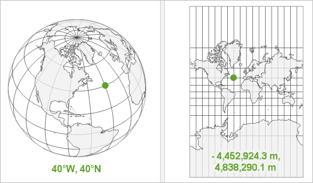

```{r setup, include=FALSE}
knitr::opts_chunk$set(echo = TRUE)
```


# **Introduction** 

## **Applications** 
</br>

*	Anything that is regional/spatial/urban economics – related 
* But geographic perspective often key for all fields of (applied) economics. For example: 

  + Border-discontinuity design 
  +	Exposure (e.g. distance) to treatment
  +	Geographic controls 
  + Spatial spillovers (e.g. exclude neighbors) 
  + Heterogeneity analysis

</br>

## **What are we talking about**
</br>

**GIS**: A geographic information system (GIS) is a system that creates, manages, analyzes, and maps all types of data. GIS connects data to a map, integrating location data (where things are) with all types of descriptive information (what things are like there). 

*1854*: John Snow identifies source of cholera spread in London through mapping of casualities and water sources. Still regarded as one of the most interesting natural experiments and one of the first difference-in-differences designs. ^[[Snow, John. 1855. On the Mode of Communication of Cholera. 2nd ed. John Churchill](https://collections.nlm.nih.gov/ext/cholera/PDF/0050707.pdf)]  

*1963*: The Canadian government had commissioned the geographer Roger Tomlinson to create a manageable inventory of its natural resources. The objective was to determine the land capability for rural Canada by mapping information about soils, agriculture, recreation, wildlife, waterfowl, forestry. First digital (Canada) Geographic Information System. ^[[esri.com](https://www.esri.com/en-us/what-is-gis/history-of-gis#:~:text=The%20First%20GIS,inventory%20of%20its%20natural%20resources.)] 

</br>

**GCS**: A **geographic coordinate system** (GCS) uses a **three-dimensional** spherical surface to define locations on the earth. A point is referenced by its **longitude** and **latitude** values. Longitude and latitude are angles measured from the earth's center to a point on the earth's surface. The **angles** often are measured in degrees ^[[esri.com](https://desktop.arcgis.com/en/arcmap/latest/map/projections/about-geographic-coordinate-systems.htm)]. Longitude is location in the East-West direction in angular distance from the Prime Meridian plane. Latitude is angular distance North or South of the equatorial plane. 

</br>

<center>

</center>
</br>

**PCS**: A **projected coordinate system** (PCS) is a geographic coordinate system (GCS) **projected** on a two-dimensional **(flat) surface**. They have an origin, x and y values. The unit of measurement is typically meters. 

</br>
<center>

</center>
</br>

This transition cannot be done without adding some **deformations**^[[Geographic vs Projected CRS - earthdatascience.org](https://www.earthdatascience.org/courses/use-data-open-source-python/intro-vector-data-python/spatial-data-vector-shapefiles/geographic-vs-projected-coordinate-reference-systems-python/)]. Therefore, some properties of the Earth’s surface are distorted in this process, such as area, direction, distance, and shape. A projected coordinate system can preserve only one or two of those properties. Different projections can be explored at: https://www.geo-projections.com/ and at https://epsg.io/. 


</br>
<center>


</center>
</br>

**Main take aways**:

</br>

* Coordinate systems are a key component of geographic objects
*	Knowing which CRS your data is in, and whether it is in geographic (lon/lat) or projected (typically meters), is key

</br>

## **Formats** 
</br>

*	.shp: Esri (ArcGIS producer) shapefile. Most common. But it comes with limitations:
    + additional files (.shx, .dbf, ...) that contain the data stored must be in the same directory as the .shp file
    + limitations in data storage (2GB)
    + limitations in attribute names (10 chars)
    + can only contain one geometry type per file
* .gpkg (geopackage) 
    + open
    + everything is stored in one single file 
    + can contain multiple layers with different geometry types (points, lines, ...)
* .gpx (GPS exchange format) used to describe waypoints, tracks and routes 
* .osm (.pbf): for data downloaded from OSM (largest crowdsourcing GIS data project in the world)
* .tif: for rasters (pixels)

</br>

## **Geometry types**
### **Vectors** 

</br>

*	points, 
*	lines 
*	polygons 
*	and their respective ‘multi’ versions (which group together features of the same type into a single feature)
*	geometry collections contain multiple geometry types in a single object

</br>

<center>
](images/sf-classes.png)
</center>

</br>

### **Rasters**

</br>

* matrix: not a vector! It’s a matrix representing equally spaced cells (also called pixels) in which each cell contain a value 

</br>

<center>

</center>

<center>
](images/raster-intro-plot2-1.png)
</center>


</br>

## **Softwares**

</br>

*	QGIS: free and open-source desktop application.
    + download and install from here: https://qgis.org/en/site/forusers/download.html
*	ArcGIS: Produced by Esri. Integrated to Python through console.  
*	Python (geopandas, shapely, fiona, pyproj, ...)
*	R	(sf, terra, raster, ggplot2, tmap, ...)
    + download and install from here: https://rstudio-education.github.io/hopr/starting.html

</br>

# **Hands-on** 
## **RStudio things**

</br>

* Integration sf and tidyverse make R coding attractive 
* Shortcuts^[see [Keyboard Shortcuts](https://support.posit.co/hc/en-us/articles/200711853-Keyboard-Shortcuts-in-the-RStudio-IDE) for more]:

  + **Comment #**: Ctrl+Shift+C // Cmd+Shift+C 
  + **Pipe %>%**: Ctrl+Shift+M // Cmd+Shift+M 

  + **Sections**: Ctrl+Shift+R // Cmd+Shift+R. 
      + Alternatively, any comment line which includes at least **4 trailing -, = or #**. (e.g. **# Section 1 - - - -**)
  + **Subsections**: **##### subsection’s title - - - -** **(starting with 5#)** (e.g. ##### Subsection 1.1 - - - - )
  + Fold selected section: Alt+L // Cmd+Option+L 
  + Unfold selected section: Shift+Alt+L // Cmd+Shift+Option+L 
  + Fold all sections: Alt+O // Cmd+Option+O
  + Unfold all sections: Shift+Alt+O // Cmd+Shift+Option+O 

  + Open/close outline: Ctrl+Shift+O // Cmd+Shift+O 

</br>

## **Maps** 
*[scripts/01.maps.R]*

</br> 

### **Data** 
*[data/raw_data]*

</br>

*	Schools of Barcelona (Barcelona City Hall) 
* Parks of Barcelona (OSM)  
*	Neighborhoods of Barcelona (Barcelona City Hall) 
*	City of Barcelona (Barcelona City Hall)
* Population by age and neighborhood (Barcelona City Hall)

</br>

**Map 1**: where are the schools and the parks of Barcelona? 

**Map 2**: neighborhoods, schools and parks of Barcelona

</br>

## **Geometrical operations**
*[scripts/02.geometry_operations.R]*

</br>

**Q1**: how many schools are there in each neighborhood (by type)? 

**Q1.1**: how many schools per kid by neighborhood?

**Q2**: how many m2 of parks per neighborhood?

**Q3**: how many schools have a park within 150m (by neighborhood)? 

</br>

## **A more realistic workflow**
*[scripts/03.data_preparation.R]*

</br>

Spatial data do not always come as shapefiles (.shp, .gpkg, etc.). They often come as .csv or .xlsx with a column holding geometry information. We’ll need to transform the data before any mapping or geometry operation. 

</br>

### **Data**
*[data/raw_data/data_preparation]*

</br>

* schools raw data: opendatabcn_llista-equipaments_educacio-csv.xlsx (Barcelona City Hall)

</br>

## **Raster and vector data interaction**
*[scripts/04.rasters.R]*

</br>

You might need to extract information contained in a raster to units of a spatial vector (e.g. polygons, points, ...). 

</br>

### **Data**
*[data/raw_data]*

</br>

*	Elevation raster (Cartographic and Geologic institute of Catalunya) 
*	Street network (Barcelona City Hall) 

</br>

**Q1**: what’s the average elevation by neighborhood? 

**Q2**: what’s the gradient of streets in Barcelona? 

</br>

## **OSM data extraction**
*[scripts/05.osm_data_extraction.R]*

</br>

OSM is a community-contributed geographic database. Anyone can [create an account](https://learnosm.org/en/beginner/) and start adding information. And anyone can access it. 

* It is a source of data which may otherwise not be freely-available. 
* Possible to get historical data through [Geofabrik](https://download.geofabrik.de/)
* However, watch out for comparison to actual data. Data coverage varies across the world and over time.  

</br>

**Q1**: what's the current cycle lanes network on OSM? 

**Q2**: how does this compare to official data? 

</br>

## **Getting more efficient: apply functions**
*[scripts/06.functions.R]*

</br>

* Stata has loops, R has functions (and loops). 
* Less coding, less likely to make mistakes. 

</br>

**Q1**: create one map of number of schools per neighborhood for each type of school. 

</br>

# **References** 

## **Maps**
* [Data visualization (with a part on Spatial Visualization) ](https://krzjoa.github.io/awesome-r-dataviz/#/)
* [Data Science for Economists and Other Animals (with a chapter on Spatial Analysis)](https://grantmcdermott.com/ds4e/spatial-analysis.html)
* [Elegant and informative maps with tmap](https://r-tmap.github.io/tmap-book/)
* [Map coloring: the color scale styles available in the tmap package](https://geocompr.github.io/post/2019/tmap-color-scales/)
* [gganimate: to animate graphs (GIFs)](https://www.datanovia.com/en/blog/gganimate-how-to-create-plots-with-beautiful-animation-in-r/) (note: you might want to check out LaTex's \\animategraphics if you plan to include a gif in your slides ;))

</br>

## **Geometrical operations**
* [Geocomputation with R](https://geocompr.robinlovelace.net/index.html)
* [R as GIS for Economists](https://tmieno2.github.io/R-as-GIS-for-Economists/index.html)
* [sf articles](https://r-spatial.github.io/sf/articles/)
* [sf functions](https://rstudio-pubs-static.s3.amazonaws.com/281635_3c84f56afc1e4b358d55fd351e768299.html)

